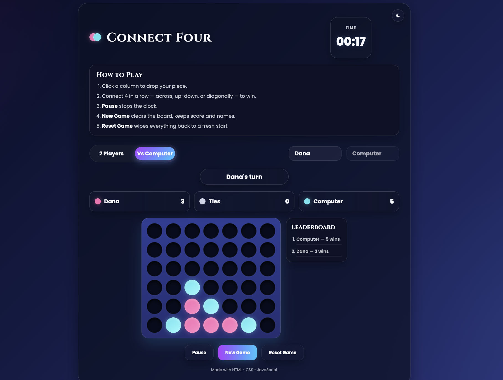
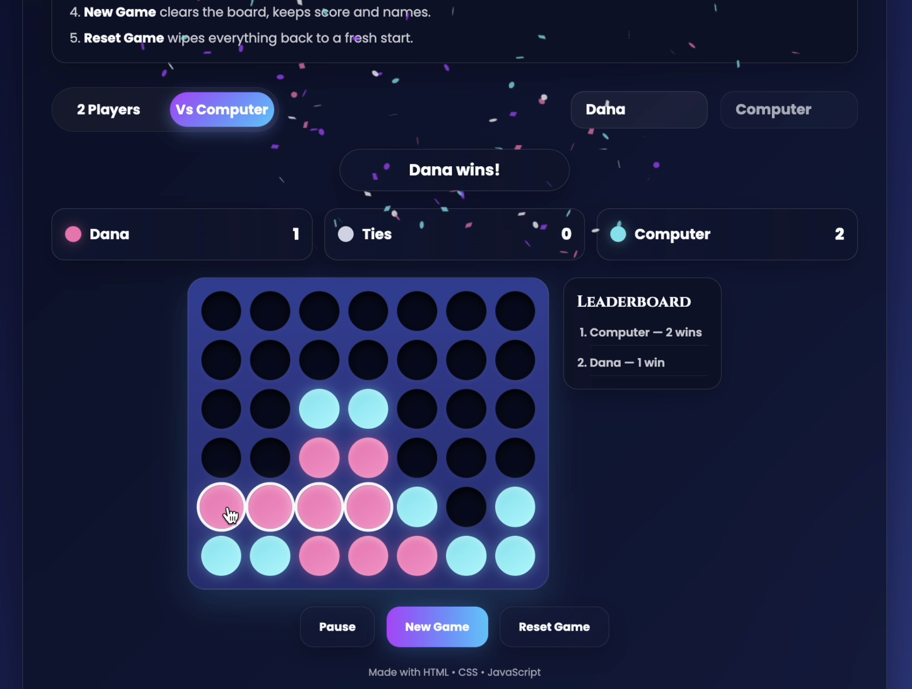
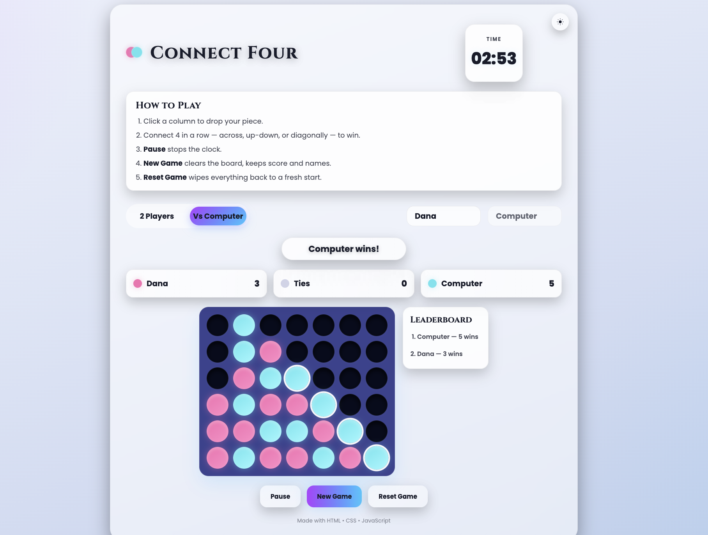
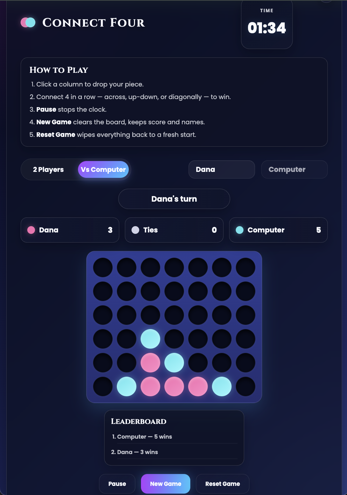

# Connect Four




A browser-based implementation of the classic **Connect Four** game, built from scratch with vanilla **HTML, CSS, and JavaScript** — no frameworks, no libraries beyond a small confetti effect. Two players (or one player against a simple computer opponent) take turns dropping discs into a 6x7 grid, racing to connect four in a row horizontally, vertically, or diagonally.

This project was built as part of the **General Assembly Software Engineering Bootcamp**, as my first solo JavaScript project focused on DOM manipulation, game logic, and state management without a framework.

---

## Background

I chose Connect Four because it's one of the games I genuinely enjoy playing, and it gave me a clear, self-contained scope to practice building a 2D grid from scratch, managing turn-based state without a framework, and layering on features like a computer opponent, persistent scores, and a leaderboard once the core game was solid.

---

## User Stories

- As a player, I want to enter my name and pick Player vs Player or Vs Computer so that I can play my way.
- As a player, I want to click a column to drop my disc so that I can take my turn.
- As a player, I want to be told whose turn it is and when there's a win or draw so that the game state is always clear.
- As a player, I want a timer, pause, and win celebration so that each round feels complete.
- As a player, I want New Game and Reset Game options so that I can replay or start fresh.
- As a player, I want my scores, leaderboard, and theme to persist after a refresh so that I don't lose progress.
- As a player, I want the game to work on any device so that I can play on desktop or mobile.

---

## Live Demo

<!-- **[Play Connect Four](https://dana12812.github.io/connect4-game/)** i will finish editing and adding comments then i will apply the link -->

---

## Getting Started

<!-- - **Play online:** [https://dana12812.github.io/connect4-game/](https://dana12812.github.io/connect4-game/)  -->

- **Planning materials:** [Figma — Connect Four Game UI](https://www.figma.com/community/file/1666701752891294298)


---

## Screenshots

| Gameplay | Winning Screen |
|---|---|
|  |  |

| Light Theme | Mobile Layout |
|---|---|
|  |  |


---

## How to Play

1. Enter names for Player 1 and Player 2 (or switch to **Vs Computer** mode).
2. Choose **2 Players** or **Vs Computer**.
3. Click any column on the board to drop your disc into the lowest open slot.
4. Players alternate turns.
5. Connect four discs in a row — horizontally, vertically, or diagonally — to win.
6. **Pause** stops the clock (and the computer) without losing your progress.
7. **New Game** clears the board for another round but keeps scores and player names.
8. **Reset Game** wipes everything — board, scores, names, theme, and the leaderboard — back to a fresh start.

---

## Features

- Player vs Player and Player vs Computer modes
- Simple computer opponent that blocks losing moves and takes winning ones when available
- Editable player names, saved between sessions
- Live scoreboard (wins for each player plus ties)
- Persistent leaderboard tracking total wins per name
- Game timer with pause/resume
- New Game (keeps scores) and Reset Game (clears everything) controls
- Win detection with the winning line highlighted on the board
- Confetti celebration on a win
- Dark and light theme toggle
- Game state saved to `localStorage`, so a reload doesn't lose your game
- Fully responsive layout for desktop, tablet, and mobile
- In-app instructions for how to play

---

## Technologies Used

- HTML5
- CSS3 (Grid, Flexbox, Media Queries, custom properties)
- JavaScript (ES6+)
- Web Storage API (`localStorage`)

---

## File Structure

```text
connect4-game
│
├── README.md
├── index.html
│
├── css
│   └── style.css
│
└── js
    └── script.js
```

---

## Installation

Clone the repository:

```bash
git clone https://github.com/dana12812/connect4-game.git
```

Navigate into the project:

```bash
cd connect4-game
```

Open `index.html` in your preferred web browser. No build step, server, or dependencies required.

---

## Next Steps

Planned future enhancements:

- Multiple AI difficulty levels
- Sound effects
- Animated disc-drop instead of an instant placement
- Online multiplayer
- Detailed player statistics
- Undo move
- Match history
- Best-of-three game mode

---

## Attributions

The following external resources were used in developing this project.

**Google Fonts** — Poppins, Cinzel
https://fonts.google.com/

**Canvas Confetti** — winning celebration animation, loaded via jsDelivr CDN
https://www.npmjs.com/package/canvas-confetti
```html
<script src="https://cdn.jsdelivr.net/npm/canvas-confetti@1.9.4/dist/confetti.browser.min.js"></script>
```

**MDN Web Docs** — reference for HTML, CSS, JavaScript, DOM manipulation, Local Storage, and event listeners
https://developer.mozilla.org/

**General Assembly** — project requirements and course materials

---

## Author

**Dana Alsaleh**
GitHub: [https://github.com/dana12812](https://github.com/dana12812)

---

## License

This project was created for educational purposes as part of the General Assembly Software Engineering Bootcamp.
